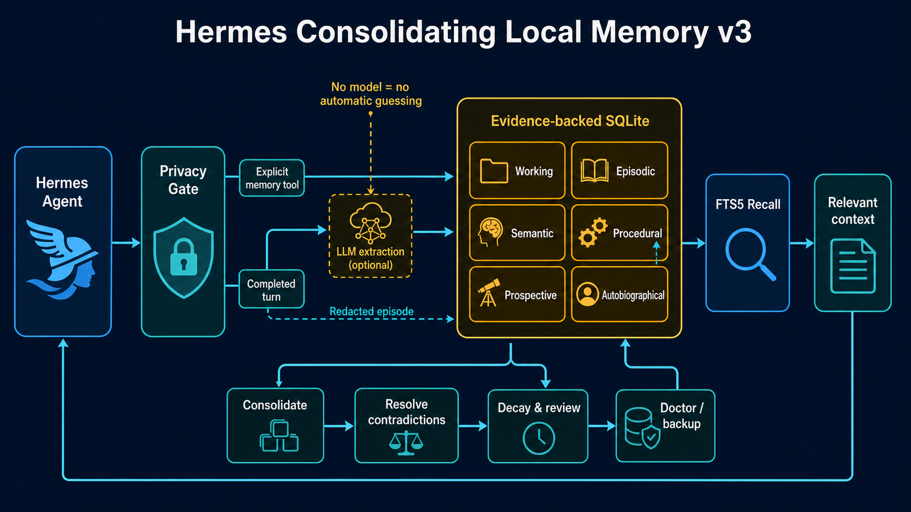

# Hermes Consolidating Local Memory

[](https://github.com/b7216309-jpg/hermes-consolidating-local-memory/actions/workflows/ci.yml)
[](https://www.python.org/)
[](CHANGELOG.md)
[](LICENSE)

A local-first, durable memory provider for [Hermes Agent](https://github.com/NousResearch/hermes-agent). It gives Hermes isolated long-term memory, evidence-backed facts, working memory, procedures, intentions, autobiographical timelines, contradiction handling, spaced review, and auditable recovery—all in SQLite.

Version 3 removes the old heuristic extractor. Automatic fact extraction is now model-backed and opt-in. With no model configured, the provider still records redacted episodes, mirrors explicit Hermes memory writes exactly, and performs local full-text recall; it never guesses facts with rules.

Version 3.3 adds structured temporal memory. The extractor receives Hermes' local date, time, and timezone; facts distinguish when something happened, when a state is valid, and when it was merely recorded; recall renders absolute and relative time without treating a past plan as a confirmed event. Version 3.2 added strict non-thinking extraction for compatible Qwen and OpenAI-style endpoints. Version 3.1 added review-first profile onboarding.



## Why use it?

- **Local by default:** SQLite and FTS5 are the canonical store. No service is required.
- **Private by design:** sensitive-memory admission, credential blocking, scope isolation, redacted exports, and optional SQLCipher encryption.
- **Evidence-aware:** each durable fact retains provenance, observations, confidence, revisions, and contradiction history.
- **Time-aware:** event time, state validity, recording time, precision, timezone, and temporal confidence remain distinct and auditable.
- **Brain-inspired memory systems:** working, episodic, semantic, procedural, prospective, autobiographical, and associative memory work together.
- **Crash-resistant:** WAL storage, a durable work spool, bounded retries, dead-letter inspection, integrity checks, atomic restore, and consistent backup.
- **Fast recall:** synchronous local FTS5 retrieval, with optional asynchronous embedding reranking.
- **Operationally visible:** native Hermes administration commands, health diagnostics, maintenance, JSON portability, and optional Markdown wiki export.

## Compatibility

| Component | Supported/tested |
| --- | --- |
| Hermes Agent | Tested end-to-end with `0.18.2` and upstream commit `226e8de827a669e8ffa7035b27d70c19e44b1208` |
| Python | `3.11`, `3.12`, and `3.13` |
| Operating systems | Linux and Windows in CI |
| Storage | SQLite with FTS5; optional SQLCipher |
| Model APIs | Explicitly configured OpenAI-compatible chat and embedding endpoints |

The Hermes compatibility simulation covers plugin discovery, provider routing, all tool actions, a real HTTP model endpoint, transient endpoint failure and durable replay, scope isolation, built-in memory mirroring, redaction, abrupt and graceful restarts, the native CLI, FTS integrity, and reference integrity.

## Install

### 1. Clone and install the plugin bundle

```console
git clone https://github.com/b7216309-jpg/hermes-consolidating-local-memory.git
cd hermes-consolidating-local-memory
python install.py
```

The installer atomically copies the provider to:

```text
$HERMES_HOME/plugins/consolidating_local/
```

`HERMES_HOME` defaults to `~/.hermes`. To target another Hermes installation:

```console
python install.py --hermes-home /path/to/hermes-home
```

Preview the destination without changing files:

```console
python install.py --dry-run
```

> Installing the Python wheel alone does not place a standalone plugin where Hermes discovers it. Use `install.py` for a Hermes installation. The wheel exists for packaging and library environments.

### 2. Select the provider

Run the Hermes setup flow and select `consolidating_local`:

```console
hermes memory setup
```

Or edit `$HERMES_HOME/config.yaml`:

```yaml
memory:
  provider: consolidating_local
```

Restart Hermes after installing or changing provider configuration.

### 3. Verify the installation

```console
hermes consolidating_local doctor
```

A healthy installation returns an `ok` status with valid SQLite integrity, matching FTS indexes, no dangling links, and no failed durable work.

### WSL2 quick start

Run installation and administration inside the same WSL distribution as Hermes. With the standard Hermes layout:

```console
wsl -d Ubuntu
cd ~/src/hermes-consolidating-local-memory
python3 install.py --hermes-home ~/.hermes
~/.hermes/hermes-agent/venv/bin/hermes memory setup
~/.hermes/hermes-agent/venv/bin/hermes consolidating_local doctor
~/.hermes/hermes-agent/venv/bin/hermes gateway restart
```

If `hermes` is already on the WSL `PATH`, the shorter `hermes ...` form is equivalent. Installing from Windows into a Windows home directory does not update a separate WSL Hermes installation; pass the WSL `--hermes-home` explicitly or run `install.py` inside WSL.

## How it works

### Capture

There are two independent write paths:

1. **Explicit memory writes:** a user or the primary Hermes agent calls the memory tool. The privacy gate checks the value, then writes the requested fact, preference, policy, procedure, intention, journal entry, or relationship exactly. No model is required.
2. **Completed turns:** Hermes sends the completed conversation turn to the provider. It stores a bounded, redacted episode and trace. When both `llm_model` and `llm_base_url` are configured, the approved text is also sent to that endpoint for structured fact extraction.

System, developer, and tool messages are excluded from conversational fact extraction. Cron, flush, and subagent contexts can recall memories but cannot mutate the primary store.

### Store and reconcile

SQLite holds the canonical state. Durable facts are linked to evidence observations, sessions, source roles, timestamps, confidence, correction markers, and history. Exclusive facts are resolved by evidence strength by default; losing claims remain available as inactive history instead of disappearing. `conflict_policy: newest` is available when last-write-wins behavior is preferred.

Every fact also has a temporal class: `atemporal`, `current`, `event`, `scheduled`, or `temporary`. The store keeps `event_at`, `valid_from`, `valid_until`, precision, source timezone, and temporal confidence separately from `created_at`, `updated_at`, and evidence-observation time. This avoids the common mistake of treating “Hermes learned this today” as “this happened today.”

### Recall

At turn start, Hermes asks the provider for relevant context. Local FTS5 recall returns a small bounded set immediately. The injected block begins with the current localized time, explains the timestamp contract, and labels recalled objects with useful absolute and relative times such as `event: 2026-07-14 18:30 CEST (yesterday)` or `recorded 3 days ago`. Expired current-state facts are excluded, while their history and linked autobiographical timeline entries remain auditable. A passed scheduled time is explicitly a past plan, not proof that the event occurred.

In `hybrid` mode, a configured embedding endpoint reranks FTS candidates off the request path and caches the result for the next turn. Sensitive text is never sent to a model endpoint unless separately allowed.

### Temporal extraction

For completed turns, the configured extractor receives `reference_unix_time`, `reference_local_time`, and `reference_timezone`. It resolves relative expressions such as “yesterday,” “tomorrow morning,” and “next Friday” against that reference. It must preserve uncertainty: a date without an hour stays day-precision, and missing details are not invented.

One-time scheduled facts receive a bounded validity window. Once that window passes they stop appearing as current state, but the original plan remains in the autobiographical timeline. Recurrent or conditional reminders remain prospective memories and should be resolved explicitly. All numeric timestamps are stored as Unix UTC seconds; timezone and precision are retained for correct local rendering.

### Consolidate

Periodic and explicit consolidation reconciles duplicates, resolves contradictions, applies salience decay, prunes eligible stale material, rebuilds summaries, advances review schedules, and removes expired raw episode bodies. A database lease prevents two Hermes processes from consolidating the same scope simultaneously.

### Recover

Background work first enters a bounded FIFO queue. Overflow and interrupted accepted work are spooled durably to SQLite. Retries use exponential backoff; a poison task moves to a visible dead-letter state after the configured attempt limit. Normal shutdown drains accepted work, while WAL recovery and spool replay protect committed work after an abrupt stop.

## Memory systems

| System | Purpose | Example |
| --- | --- | --- |
| Working | Short-lived, prioritized slots for the active session | “The current debugging target is the queue worker.” |
| Episodic | What happened in a particular turn or session | “We migrated the project on Tuesday.” |
| Semantic | Durable facts, preferences, policies, and topic summaries | “The project uses PostgreSQL.” |
| Procedural | Reusable steps, prerequisites, recovery, and outcome statistics | “Release the package with these six steps.” |
| Prospective | Due or conditional intentions | “Remind me to rotate the key next month.” |
| Autobiographical | Important events arranged as a timeline | “The team launched version 3.” |
| Associative | Weighted links used for pattern completion and related recall | “Project Atlas” ↔ “deployment checklist” |
| Metamemory | Provenance, confidence, history, contradiction, review, and health data | “Why does Hermes believe this fact?” |

## Configuration

Provider selection uses the underscore name `consolidating_local`. Advanced options live under the plugin configuration key `consolidating-local-memory`:

```yaml
memory:
  provider: consolidating_local

# Used by Hermes message timestamps and by temporal extraction/recall.
timezone: Europe/Paris

plugins:
  consolidating-local-memory:
    db_path: $HERMES_HOME/consolidating_memory.db
    memory_scope: user
    sensitive_memory: ask
    conflict_policy: evidence
    retrieval_backend: fts
```

All advanced options are optional.

Set Hermes' top-level `timezone` to a valid IANA name. The provider uses the same native Hermes timezone when available, with the host timezone as a fallback. Native gateway message timestamps and structured memory time complement one another: message timestamps orient the current transcript, while this plugin preserves temporal meaning after consolidation.

### Hardened hybrid example

This example combines a local OpenAI-compatible extractor, inexpensive OpenAI embeddings, per-user isolation, SQLCipher, and fail-closed remote privacy:

```yaml
memory:
  provider: consolidating_local

plugins:
  consolidating-local-memory:
    db_path: $HERMES_HOME/consolidating_memory_encrypted.db
    memory_scope: user
    database_encryption: true
    sensitive_memory: ask
    allow_credential_memory: false
    allow_sensitive_model_processing: false
    export_redact_sensitive: true

    llm_model: YOUR_LOCAL_QWEN_MODEL_NAME
    llm_base_url: http://WSL_HOST_OR_LAN_IP:8080/v1
    llm_disable_thinking: true
    llm_timeout_seconds: 45

    retrieval_backend: hybrid
    embedding_model: text-embedding-3-small
    embedding_base_url: https://api.openai.com/v1
    embedding_timeout_seconds: 30
    embedding_candidate_limit: 16
    prefetch_cache_ttl_seconds: 120
```

Keep keys outside `config.yaml`. Hermes loads its private environment from the process environment or its protected environment file:

```dotenv
CONSOLIDATING_MEMORY_DB_KEY=GENERATE_A_LONG_RANDOM_VALUE
CONSOLIDATING_MEMORY_EMBEDDING_API_KEY=YOUR_OPENAI_API_KEY
# Only needed when the extraction endpoint requires authentication:
CONSOLIDATING_MEMORY_LLM_API_KEY=YOUR_LOCAL_ENDPOINT_KEY
```

```console
chmod 600 ~/.hermes/.env
```

Never commit `.env`, paste live keys into issues or chat, or reuse a key after accidental exposure.

### Scope and privacy

| Option | Default | Meaning |
| --- | --- | --- |
| `db_path` | `$HERMES_HOME/consolidating_memory.db` | Base SQLite path. User/agent scopes derive isolated hashed paths from it. |
| `memory_scope` | `user` | Isolation boundary: `user`, `agent`, or `global`. |
| `sensitive_memory` | `ask` | Sensitive admission policy: `deny`, `ask`, or `allow`. |
| `allow_credential_memory` | `false` | Allows credentials to follow `sensitive_memory`; otherwise credentials are always rejected. |
| `allow_sensitive_model_processing` | `false` | Allows configured LLM/embedding endpoints to receive admitted sensitive text. |
| `conflict_policy` | `evidence` | Contradiction policy: `evidence` or `newest`. |
| `never_remember_categories` | empty | Comma-separated categories rejected before storage. |
| `database_encryption` | `false` | Requires SQLCipher and `CONSOLIDATING_MEMORY_DB_KEY`. |
| `export_redact_sensitive` | `true` | Omits sensitive material from portable JSON and wiki exports. |

Scope behavior:

| Scope | Isolation behavior |
| --- | --- |
| `user` | A distinct hashed database and wiki directory for every authenticated gateway user. A local CLI session without user identity uses the configured base database. |
| `agent` | A distinct store for each Hermes agent identity. |
| `global` | One shared configured store. Use only when deliberate cross-user sharing is acceptable. |

Shared `USER.md` and `MEMORY.md` snapshot writes are refused for `user` and `agent` scopes because those files are not identity-isolated.

### Automatic fact extraction

Automatic extraction is disabled unless both settings are present:

```yaml
plugins:
  consolidating-local-memory:
    llm_model: your-model-name
    llm_base_url: http://127.0.0.1:8000/v1
    llm_disable_thinking: false
    llm_timeout_seconds: 45
    llm_failure_cooldown_seconds: 120
    llm_max_input_chars: 4000
```

Set an API key only if the endpoint needs one:

```console
export CONSOLIDATING_MEMORY_LLM_API_KEY="..."
```

On PowerShell:

```powershell
$env:CONSOLIDATING_MEMORY_LLM_API_KEY = "..."
```

The provider never inherits Hermes' normal chat endpoint implicitly. Requiring an explicit endpoint avoids accidentally sending memory text to a service the operator did not choose. When no extraction endpoint is configured, explicit memory writes still work and the provider does not fall back to heuristic guessing.

For a Qwen reasoning model served by llama.cpp, vLLM, or another endpoint that accepts Qwen chat-template arguments, enable strict non-thinking extraction:

```yaml
plugins:
  consolidating-local-memory:
    llm_model: your-qwen-model
    llm_base_url: http://127.0.0.1:8080/v1
    llm_disable_thinking: true
```

The plugin then sends `chat_template_kwargs.enable_thinking=false`, matching Hermes' compression mechanism. This saves reasoning tokens and makes short JSON extraction more reliable. Strict mode accepts only visible assistant content: a server that ignores the flag and returns only `reasoning_content` causes a recoverable extraction failure instead of allowing scratch reasoning into memory. Leave the option `false` for endpoints that do not support this request field. The option applies to OpenAI-compatible chat-completion endpoints; Codex Responses backends ignore it.

### Hybrid retrieval

FTS5 is the safe, zero-service default. To add semantic reranking:

```yaml
plugins:
  consolidating-local-memory:
    retrieval_backend: hybrid
    embedding_model: your-embedding-model
    embedding_base_url: http://127.0.0.1:8001/v1
    embedding_timeout_seconds: 20
    embedding_candidate_limit: 16
    prefetch_cache_ttl_seconds: 120
```

If required, set `CONSOLIDATING_MEMORY_EMBEDDING_API_KEY`. Both the embedding model and base URL are required; otherwise recall remains local FTS.

For OpenAI, a low-cost configuration is:

```yaml
plugins:
  consolidating-local-memory:
    retrieval_backend: hybrid
    embedding_model: text-embedding-3-small
    embedding_base_url: https://api.openai.com/v1
```

`text-embedding-3-small` produces 1,536-dimensional vectors. See the [official OpenAI model page](https://developers.openai.com/api/docs/models/text-embedding-3-small) for current pricing and limits.

Hybrid retrieval remains FTS-first. The provider selects bounded local candidates and only then asks the embedding endpoint to rerank them. It skips the remote call and keeps the FTS ordering when the query/results are sensitive, any result carries `local_only`, the endpoint is unavailable, or the circuit breaker is open. Onboarding entries and topic summaries derived from them carry `local_only` automatically.

### SQLCipher encryption

Install SQLCipher support into the same Python environment that runs Hermes:

```console
python -m pip install "sqlcipher3>=0.6.2"
```

For development from this repository, `python -m pip install -e ".[encryption]"` is equivalent. Then set a strong key and enable encryption:

```console
export CONSOLIDATING_MEMORY_DB_KEY="use-a-secret-from-your-password-manager"
```

```yaml
plugins:
  consolidating-local-memory:
    database_encryption: true
```

Encrypted mode fails closed: the provider is unavailable if the dependency or key is missing, and a wrong key cannot open the database. SQLite backups remain encrypted and complete. Portable JSON/wiki exports follow `export_redact_sensitive` but are not encrypted by the plugin; protect their destination separately.

Enabling `database_encryption` does not convert an existing plaintext SQLite file in place. Use a new `db_path` and migrate deliberately:

1. Stop Hermes and create a normal SQLite backup.
2. Export the old database. Use `--include-sensitive` only in a protected directory when a complete migration is required.
3. Install `sqlcipher3` into the Hermes Python environment.
4. Set `CONSOLIDATING_MEMORY_DB_KEY`, enable encryption, and point `db_path` at a new filename.
5. Import the protected JSON with `--confirm`, run `doctor`, and retain the old database until validation is complete.
6. Securely remove the temporary unencrypted JSON when it is no longer required.

```console
hermes gateway stop
hermes consolidating_local backup ~/memory-before-encryption.db
hermes consolidating_local export ~/memory-migration.json --include-sensitive
# Update config.yaml and ~/.hermes/.env, then:
hermes consolidating_local import ~/memory-migration.json --confirm
hermes consolidating_local doctor
hermes gateway restart
```

Repeat migration per derived database when `memory_scope` is `user` or `agent`. Treat plaintext exports and old databases as secrets.

### Queue, retention, and consolidation

| Option | Default | Meaning |
| --- | ---: | --- |
| `queue_max_size` | `256` | Maximum in-memory background tasks before durable spooling. |
| `queue_max_attempts` | `5` | Attempts before recoverable dead-letter status. |
| `shutdown_timeout_seconds` | `10` | Graceful worker-drain wait. |
| `max_database_mb` | `512` | Soft size budget used by maintenance. |
| `trace_retention_days` | `30` | Retention for inactive turn traces. |
| `history_retention_days` | `180` | Retention for operational history. |
| `sensitive_retention_days` | `30` | Retention for inactive sensitive facts. |
| `consolidation_max_batches` | `4` | Immediate passes allowed while a backlog remains. |
| `consolidation_batch_size` | `250` | Episode buffers per atomic consolidation pass. |
| `min_hours` | `24` | Minimum hours between background consolidations. |
| `min_sessions` | `5` | Distinct sessions required since the last consolidation. |
| `scan_cooldown_seconds` | `600` | Active-use consolidation gate check interval. |
| `prune_after_days` | `90` | Age threshold for pruning low-value extracted facts. |
| `episode_body_retention_hours` | `24` | Raw episode-body retention after consolidation. |

### Recall and cognitive tuning

| Option | Default | Meaning |
| --- | ---: | --- |
| `working_memory_capacity` | `12` | Working-memory slots per session. |
| `prefetch_limit` | `8` | Memory lines injected into context. |
| `max_topic_facts` | `5` | Top facts packed into each topic summary. |
| `topic_summary_chars` | `650` | Topic-summary character budget. |
| `session_summary_chars` | `900` | Session/handoff-summary character budget. |
| `decay_half_life_days` | `90` | Default salience half-life. |
| `decay_min_salience` | `0.15` | Threshold for deactivating low-priority items. |
| `reconsolidation_window_hours` | `6` | Time after recall during which a memory can be reconsolidated. |
| `review_intervals_days` | `1,3,7,14,30` | Spaced-review schedule. |

### Snapshots and wiki export

| Option | Default | Meaning |
| --- | --- | --- |
| `builtin_snapshot_sync_enabled` | `false` | Maintains bounded Hermes `USER.md`/`MEMORY.md` current-state snapshots in global scope. |
| `builtin_memory_dir` | `$HERMES_HOME/memories` | Snapshot directory. |
| `builtin_snapshot_user_chars` | `1375` | `USER.md` character budget. |
| `builtin_snapshot_memory_chars` | `2200` | `MEMORY.md` character budget. |
| `wiki_export_enabled` | `false` | Builds a navigable Markdown memory wiki. |
| `wiki_export_dir` | `$HERMES_HOME/consolidating_memory_wiki` | Wiki destination. |
| `wiki_export_on_consolidate` | `true` | Refreshes the wiki after consolidation. |
| `wiki_export_session_limit` | `50` | Maximum exported session pages. |
| `wiki_export_topic_limit` | `100` | Maximum exported topic pages. |

Generated wiki files are written atomically. A manifest lets later exports remove only plugin-generated stale pages, leaving manually created notes untouched.

## Memory tool actions

The provider exposes the `consolidating_memory` tool with 28 actions:

| Group | Actions |
| --- | --- |
| Recall and inspect | `search`, `recent`, `contradictions`, `status`, `history`, `explain`, `timeline` |
| Write and curate | `remember`, `forget`, `journal`, `policy`, `associate`, `merge`, `split`, `pin` |
| Cognitive systems | `working`, `procedure`, `intention`, `review`, `decay` |
| Consolidate and export | `consolidate`, `distill`, `export`, `export_json` |
| Consent and operations | `approval`, `doctor`, `maintain`, `backup` |

Mutating or sensitive actions are rejected outside the primary agent context. The tool schema describes the required fields for each action directly to Hermes.

`remember` and `timeline` accept optional Unix temporal fields: `event_at`, `valid_from`, `valid_until`, `temporal_kind`, `temporal_precision`, `temporal_timezone`, and `temporal_confidence`. Use `event_at` for when an event happened or is planned, validity fields for how long a state applies, and leave unknown precision unknown rather than supplying a guessed hour. An explicit `event` or `scheduled` fact requires `event_at`; the provider will not substitute the time it learned the fact. Dated `remember` facts are linked into the same persistent timeline as extracted facts.

## Guided onboarding

`onboard` builds an initial user profile without creating a separate profile silo. Answers become normal memory objects:

| Answer group | Stored as |
| --- | --- |
| Preferred name, pronouns, timezone, occupation, broad location | Pinned semantic facts |
| Languages, response style/tone, preferred tools | Preferences |
| Technical interests and active projects | Semantic facts |
| Current goals | Prospective intentions |
| Approval and never-remember rules | Policies |
| A recurring workflow | Procedure |
| Additional stable context | Semantic fact |

The interactive flow asks 17 skippable questions, renders every proposed item, and defaults to cancellation. It never calls an extraction model. Credential-like answers are discarded without being copied into the preview or database. `--skip-sensitive` additionally excludes health, financial, identity, and precise-location entries.

```console
# Interactive interview; nothing is written until the final yes
hermes consolidating_local onboard

# File-driven workflow for review or team-assisted setup
hermes consolidating_local onboard --template ~/hermes-onboarding.json
# Edit the generated JSON, then preview without writing:
hermes consolidating_local onboard --answers ~/hermes-onboarding.json --preview-only
# Apply only after reviewing that preview:
hermes consolidating_local onboard --answers ~/hermes-onboarding.json --yes

# Exclude every answer classified as sensitive
hermes consolidating_local onboard --skip-sensitive
```

The template is created with restrictive permissions where the platform supports them and refuses to overwrite an existing file. Inputs are bounded, unknown JSON keys fail validation, and identical reruns are true no-ops: they do not add duplicate facts, evidence, intentions, or history. Changed deterministic fields update or supersede the existing memory through the normal evidence/history machinery.

All accepted onboarding entries carry `local_only` provenance. They remain visible through local FTS recall, but a hybrid result set containing them bypasses the remote embedding endpoint. Rebuilt topic summaries inherit the restriction.

### Target the correct memory scope

With the default `memory_scope: user`, local CLI memory and a Telegram user's memory are different encrypted databases. Apply the reviewed profile separately when it should be available in both places:

```console
# Local CLI scope
hermes consolidating_local onboard --answers ~/hermes-onboarding.json --yes

# The same Telegram user scope that Hermes derives at runtime
hermes consolidating_local \
  --scope-platform telegram \
  --scope-user-id YOUR_TELEGRAM_USER_ID \
  onboard --answers ~/hermes-onboarding.json --yes
```

The raw identity is used only to reproduce Hermes' SHA-256-derived scope path; it is not stored in the database filename. For `memory_scope: agent`, use `--scope-agent-identity` with the runtime platform and, when applicable, user ID. Omitting all scope options intentionally targets local/CLI memory. Scope options may be combined with `--db` when overriding the configured base path.

## Administration

Native commands are available after Hermes discovers the plugin:

```console
# Read-only integrity, index, reference, queue, and size checks
hermes consolidating_local doctor

# Rebuild indexes and remove dangling links
hermes consolidating_local doctor --repair

# Complete, unredacted, consistent SQLite backup
hermes consolidating_local backup /path/to/backup.db

# Verified atomic restore; confirmation is mandatory
hermes consolidating_local restore /path/to/backup.db --confirm

# Portable JSON (redacted by default)
hermes consolidating_local export /path/to/memory.json
hermes consolidating_local import /path/to/memory.json --confirm

# Explicitly requeue recoverable dead-letter work
hermes consolidating_local retry-failed --confirm --limit 100

# Apply retention, size-budget, and vacuum maintenance
hermes consolidating_local maintain
```

Root scope options work with every administration subcommand, not only onboarding:

```console
hermes consolidating_local \
  --scope-platform telegram \
  --scope-user-id YOUR_TELEGRAM_USER_ID \
  doctor
```

When the exact database file is already known, place `--db` before the subcommand:

```console
hermes consolidating_local --db /path/to/scoped.db doctor
```

Set `CONSOLIDATING_MEMORY_DB_KEY` before every administration command for an encrypted database. Stop Hermes before repair, restore, import, or maintenance. Online backup is consistent, but a quiet process is still preferable during operational work.

From a source checkout, the underlying administration entry point is:

```console
python -m plugins.memory.consolidating_local.admin --db /path/to/database.db doctor
```

## Upgrade from an earlier version

1. Stop Hermes.
2. Back up the current database.
3. Pull the new repository version.
4. Run `python install.py` again. The installer stages the replacement and rolls back if activation fails.
5. Start Hermes and run `hermes consolidating_local doctor`.

Version 3 removes `consolidator.py` and every rule-based extraction path. The obsolete `extractor_backend` setting is safely ignored if it remains in an old configuration. Existing durable facts are preserved; startup applies recorded additive migrations and rebuilds supporting indexes when necessary.

Version 3.3 adds the recorded `structured_temporal_context` migration. Existing facts are classified conservatively from durable metadata without inventing event dates: exclusive state facts become `current`, dated validity becomes `temporary`, autobiographical facts become `event`, and other facts remain `atemporal`. Reinstalling is sufficient; startup adds the columns and index atomically. Run `doctor` after the first start.

Version 3.2 added the optional `llm_disable_thinking` extraction setting without changing the database schema. Reinstall the plugin bundle, then enable the option only if the configured OpenAI-compatible endpoint supports Qwen chat-template arguments. Version 3.1 added the onboarding module and scope-aware native CLI; running onboarding against an existing profile remains safe because unchanged entries do not create duplicate evidence/history.

## Data locations

| Data | Default location |
| --- | --- |
| Installed plugin | `$HERMES_HOME/plugins/consolidating_local/` |
| Base/global database | `$HERMES_HOME/consolidating_memory.db` |
| User/agent databases | `<db_stem>_scopes/<24-character SHA-256 prefix>.db` beside the configured base path |
| Built-in snapshots | `$HERMES_HOME/memories/` when explicitly enabled and safe |
| Markdown wiki | `$HERMES_HOME/consolidating_memory_wiki/` when enabled |
| Recommended operational backups | A protected directory under `$HERMES_HOME/backups/` |

The database is canonical. Snapshots and wiki pages are rebuildable views.

## Ready-to-use checklist

After installation or an upgrade, the following is a practical green-light check:

```console
# Provider discovery and selection
hermes memory status

# Local/CLI database
hermes consolidating_local doctor

# Optional gateway user database
hermes consolidating_local \
  --scope-platform telegram \
  --scope-user-id YOUR_TELEGRAM_USER_ID \
  doctor

# Gateway runtime
hermes gateway status
```

The provider should be selected and available; every `doctor` result should have `ok: true`, `integrity: ["ok"]`, matching FTS counts, and zero failed operations; the gateway should be active. For model-backed extraction or hybrid recall, also verify the configured `/v1/models` or `/v1/embeddings` endpoint from the Hermes host. Endpoint failure is non-destructive: FTS recall remains available and recoverable extraction work follows the durable retry policy.

## Troubleshooting

| Symptom | What to check |
| --- | --- |
| `consolidating_local` is not listed | Run `python install.py`; confirm `$HERMES_HOME/plugins/consolidating_local/plugin.yaml` exists; restart Hermes. |
| Provider reports unavailable | If encryption is enabled, install `sqlcipher3` and set `CONSOLIDATING_MEMORY_DB_KEY` in the Hermes process environment. |
| Explicit writes work but no automatic facts appear | Configure both `llm_model` and `llm_base_url`. This is intentional—there is no heuristic fallback. |
| Extraction retries with `model response did not contain visible content` | A reasoning endpoint returned no final answer. If it supports Qwen chat-template arguments, set `llm_disable_thinking: true`; otherwise disable that option and inspect the endpoint's reasoning configuration. |
| A remembered plan is shown as completed | A schedule records intent, not outcome. Store a later event or explicit correction when it actually happens; passed schedules are labeled as unconfirmed and remain only in timeline/history after expiry. |
| A relative date resolves in the wrong zone | Set Hermes' top-level `timezone` to the correct IANA name, restart the gateway, and inspect the fact's `temporal_timezone` and precision in the Control Center or JSON export. |
| Semantically similar wording is missed | Default FTS is lexical. Configure `retrieval_backend: hybrid` plus both embedding settings. |
| CLI shows an empty database | Local CLI and gateway users are isolated by default. Use `--scope-platform` plus `--scope-user-id`, or pass the exact scoped database with `--db`. |
| Onboarded profile appears in CLI but not Telegram | Apply the same reviewed answer file to the Telegram scope; onboarding does not copy personal profiles across users automatically. |
| Hybrid recall does not call the embedding endpoint | Sensitive or `local_only` results intentionally disable remote reranking. Onboarding profile entries are always `local_only`. |
| `file is not a database` after enabling encryption | A plaintext database was opened as SQLCipher or the key is wrong. Restore the correct key or migrate into a new encrypted `db_path`; do not convert in place. |
| `doctor` reports failed work | Inspect the reported errors, correct the underlying cause, then use `retry-failed --confirm`. A task may have partially completed before failing. |
| Sensitive memory is waiting | With `sensitive_memory: ask`, inspect and resolve the durable approval inbox using the `approval` tool action. |
| A wiki export omits data | Sensitive material is redacted by default and export page limits may apply. |

## Limitations and security notes

- Default FTS recall is lexical; semantic matching requires an embedding endpoint.
- Automatic fact extraction requires an explicitly configured model endpoint. This is a privacy and correctness boundary, not a missing fallback.
- SQLite is designed for a local host. WAL, leases, and durable replay handle normal multi-process access, but network filesystems are not recommended.
- Extraction quality depends on the configured model. Evidence, correction, history, approval, and review mechanisms reduce risk but do not make model output infallible.
- `global` scope intentionally shares memory. Do not use it for unrelated or untrusted users.
- SQLite backups are complete and unredacted. Treat them as secrets even when portable exports are configured to redact sensitive records.
- Onboarding's `local_only` flag protects against the plugin's remote embedding client. Memory recalled into Hermes context is still visible to Hermes' active chat model; choose that model and its data policy accordingly.
- Keep database, LLM, and embedding keys out of `config.yaml`, source control, logs, screenshots, issues, and chat. Protect the environment file with mode `0600` and rotate any exposed key.
- A raw gateway user ID is required to derive a user-scoped database from the CLI. It is hashed into the filename, but command history may still retain the raw argument; use an appropriately protected shell/session.

## Development

```console
git clone https://github.com/b7216309-jpg/hermes-consolidating-local-memory.git
cd hermes-consolidating-local-memory
python -m pip install -e ".[dev]"
python -m pytest -q -ra
python -m ruff check .
python -m ruff format --check .
python -m compileall -q plugins tests install.py
python -m pip wheel --no-deps . --wheel-dir dist
```

To include SQLCipher tests:

```console
python -m pip install -e ".[dev,encryption]"
python -m pytest tests/test_encryption.py
```

CI runs the test, lint, formatting, compilation, build, and encryption smoke suites across the supported platforms and Python versions.

## More documentation

- [Architecture, schema, privacy, and recovery deep dive](docs/PLUGIN_DEEP_DIVE.md)
- [Hermes memory control and operational model](docs/HERMES_MEMORY_CONTROL.md)
- [Plugin-bundle integration notes](plugins/memory/consolidating_local/README.md)
- [Release history](CHANGELOG.md)

Issues and focused pull requests are welcome. Please include the Hermes version, Python version, operating system, relevant configuration with secrets removed, and `doctor` output when reporting a runtime problem.

## License

[MIT](LICENSE)
